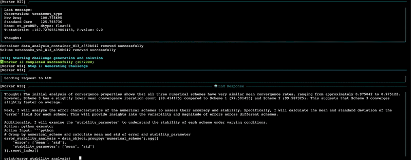

## Datarus-R1 Jupyter Agent

<div align="center">
  
  
  [](https://huggingface.co/DatarusAI/Datarus-R1-14B-preview)
  [](LICENSE)
  [](https://datarus.ai)
  [](https://chat.datarus.ai)
  [](https://arxiv.org/abs/XXXX.XXXXX)
</div>


<p align="center">
    🌐 <a href="https://datarus.ai"><b>Website</b></a>&nbsp&nbsp | &nbsp&nbsp💬 <a href="https://chat.datarus.ai"><b>Datarus Chat</b></a>&nbsp&nbsp | &nbsp&nbsp🤗 <a href="https://huggingface.co/DatarusAI/Datarus-R1-14B-preview"><b>Hugging Face</b></a>&nbsp&nbsp | &nbsp&nbsp📄 <a href="https://arxiv.org/abs/xxxxxx"><b>Paper</b></a>
</p>

<p align="center">
    <em>A sophisticated multi-step reasoning pipeline powered by the Datarus-R1-14B-Preview model, designed for complex data science and analysis tasks. This pipeline leverages a highly capable 14B parameter model to provide intelligent, step-by-step analysis of your data.</em>
</p>

 
## 🚀 Introduction

The **Datarus Jupyter Agent** is a powerful multi-step reasoning system that executes complex analytical workflows with step-by-step reasoning, automatic error recovery, and comprehensive result synthesis. This pipeline provides a robust framework for running iterative analysis tasks in isolated Docker environments with full Jupyter notebook integration.

We built this pipeline specifically for **Datarus-R1-14B-Preview**, our 14B-parameter language model that achieves up to 30% higher accuracy on AIME 2024/2025 and LiveCodeBench while emitting 18–49% fewer tokens compared to similar size models. Datarus-R1-14B-Preview is fine-tuned from Qwen 2.5-14B-Instruct to act as a virtual data analyst, trained on full analytical trajectories including reasoning steps, code execution, error traces, and self-corrections.



## ✨ Features

- **Multi-Step Reasoning**: Executes complex workflows with step-by-step reasoning using Datarus model
- **Docker Integration**: Isolated execution environment using Jupyter containers
- **Improved Kernel Management**: Direct kernel communication using jupyter_client for reliable execution
- **Comprehensive ML Support**: Built-in support for TensorFlow, PyTorch, and scikit-learn
- **Intelligent Error Recovery**: Automatic error detection and correction attempts
- **Rich Console Output**: Beautiful terminal output with syntax highlighting
- **Notebook Management**: Automatic creation and management of Jupyter notebooks
- **Dynamic Port Allocation**: Automatically finds available ports for Jupyter server
- **Notebook Export**: Save final notebooks for review and sharing


## 🏃‍♂️ Quick Start

```bash
# 1. Clone the repository
git clone https://github.com/DatarusAI/Datarus-JupyterAgent.git
cd datarus-pipeline

# 2. Run setup script
./scripts/setup.sh

# 3. Start the model server (in a separate terminal)
vllm serve DatarusAI/Datarus-R1-14B-preview

# 4. Run with a challenge file
python src/main.py --challenge challenges/example_challenge.json

# Or run with a custom query
python src/main.py --query "Analyze this dataset and build a predictive model"

# Export notebook to specific path
python src/main.py --challenge challenges/example_challenge.json --output-notebook results/analysis.ipynb
```

## 🔧 Configuration

### For Remote Server Setup

If you're running the Docker daemon or model server on a remote machine, set these environment variables in your `.env` file. The `config/config.yaml` file also allows detailed customization.


## 🎯 Usage Examples

### Basic Data Analysis

```python
from src.core.agent import DatarusAgent
from src.utils.config_loader import load_config

# Load configuration
config = load_config()

# Initialize agent
agent = DatarusAgent(
    api_key="",  # Optional, only if your server requires auth
    challenge_config={},
    config=config
)

# Process a complex analysis query
result = agent.process_query("""
Load the sales_data.csv file and:
1. Perform exploratory data analysis
2. Identify seasonal patterns and trends
3. Build a forecasting model
4. Generate visualizations
5. Provide business recommendations
""")

print(result)
```

### Challenge-Based Analysis

Create a challenge file `challenge.json`:

```json
{
  "domain": "datascience",
  "scenario": "A financial services company is experiencing issues with their credit risk prediction model. The model is used to predict the likelihood of loan default based on various customer attributes. The company suspects that data quality issues are affecting the model's performance.",
  "objective": "Identify and analyze data quality patterns that may be affecting the performance of the credit risk prediction model, ensuring the model can generalize well and is free from bias.",
  "user_prompt": "Analyze the provided financial dataset....",
  "dataset_generation_code": "import sys\nimport ...",
  "uuid": "example-001"
}
```

Run the analysis:

```bash
python src/main.py --challenge challenge.json --output-notebook customer_analysis.ipynb
```

## 🏗️ Architecture

### Core Components

- **DatarusAgent** (`agent.py`): Main orchestration class that manages the multi-step reasoning pipeline
  - Handles message formatting and LLM communication
  - Parses model responses to extract steps and actions
  - Manages error recovery and retry logic
  
- **NotebookManager** (`notebook_manager.py`): Docker and Jupyter notebook management
  - Creates and manages Docker containers
  - Executes code cells via jupyter_client
  - Tracks step outputs and errors
  - Handles notebook persistence
  
- **ConsoleLogger** (`logger.py`): Rich terminal output with structured logging
  - Color-coded step visualization
  - Syntax highlighting for code blocks
  - Progress tracking and error display
  
- **ConfigLoader** (`config_loader.py`): Configuration management
  - Loads YAML configuration files
  - Merges environment variables
  - Provides default values

### Execution Flow

1. **Query Reception**: User provides a query or challenge
2. **Environment Setup**: Pipeline initializes Docker container with Jupyter
3. **Step Planning**: Datarus model breaks down the task into steps
4. **Iterative Execution**: 
   - Model generates thought + code for each step
   - Pipeline executes code in isolated environment
   - Results are captured and fed back to model
5. **Error Handling**: Automatic retry on errors with context
6. **Result Synthesis**: Final answer compiled from all steps

## 🔄 Dual Reasoning Modes

The pipeline supports two reasoning patterns from Datarus:

### Agentic Mode (ReAct)
Used for interactive, step-by-step analysis:

```xml
<step>
<thought>I need to check for missing values in the dataset</thought>
<action>python_executor</action>
<action_input>
# Check for missing values
missing_values = data_object.isnull().sum()
print("Missing values per column:")
print(missing_values[missing_values > 0])
</action_input>
</step>
```

### Reflection Mode (CoT)
Used for final synthesis and conclusions:

```xml
<stop_analysis>
<thought>Based on the analysis, I can now provide recommendations</thought>
<answer>
The customer segmentation revealed 3 distinct groups:
1. High-value frequent buyers (15% of base)
2. Regular customers (60% of base)  
3. Dormant customers requiring reactivation (25% of base)

Recommended actions: Target group 1 with premium offers...
</answer>
</stop_analysis>
```

## ⭐ Support

If you find this pipeline useful, please consider starring the repository! Your support helps us continue improving the project.

Found a bug or have a feature request? Please open an issue on GitHub.

---

<p align="center">Made with ❤️ by the Datarus Team from Paris</p>
